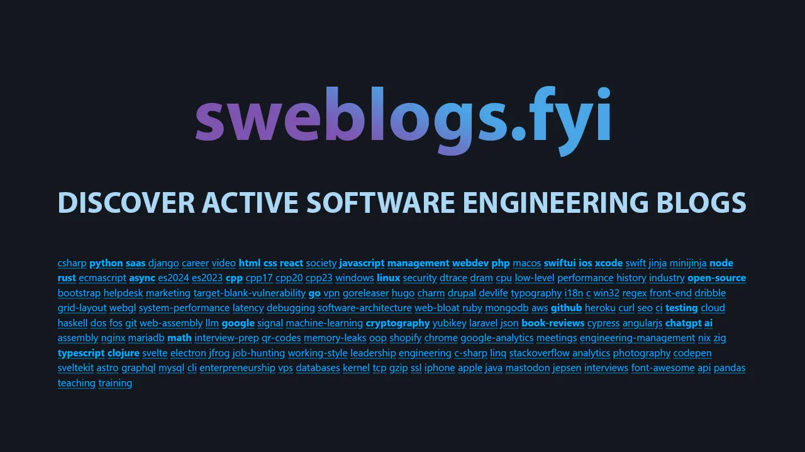

# Software Engineering Blog Directory

Welcome to the __Software Engineering Blog Directory__ 🙂! This is a growing list of non-corporate, active software engineering blogs from around the world. Our mission is to help engineers discover new voices, perspectives, and insights in the tech community.

We'd love for you to contribute and help us keep this directory fresh and valuable!

[Link to the site](https://sweblogs.fyi/) 🔗

## How to contribute 🚀

Contributing is simple and we encourage everyone to get involved!

1. Fork this repository.
1. Make your changes to the [data.json](https://github.com/rtdev-com/swe-blog-directory/blob/main/data.json) file (where all the blog data is stored).
1. Open a pull request when you're ready, and GitHub Actions will automatically handle the build 🏗 and deployment 🚀.

Don’t worry if you’re new to GitHub; we're happy to help guide you through the process if needed!

### Contribution Guidelines ✍️

To maintain the quality and relevance of the directory, we ask that any new blog submissions meet these simple criteria:

1. Blog Age: The blog should be at least 1 year old.
1. Posting Frequency: At least 1 post per quarter (4 per year).
1. Recency: The latest post should be within the last 3 months.
1. Author Type: Blogs must be written by individuals or small groups—no corporate or heavily commercialized blogs, please!

If you're unsure whether a blog qualifies, feel free to open a discussion, and we'll take a look together!

### Running Locally

Want to try things out or preview the directory on your machine? You can build the project locally by following these steps:

1. Install the dependencies: `pip install -r requirements.txt`
1. Build the directory: `python build.py`
1. Check the `/output` directory for the generated artifacts.

## More information

We’re so excited to have you here, and we look forward to seeing the fantastic blogs you’ll add to the directory! If you’re curious about how this project came to life, here is a [blog post](https://romantaylor.com/directory-of-software-engineering-blogs/) detailing the thought process behind building this directory. And as always, if you have any questions, feel free to open an issue or start a discussion. Let's make the Software Engineering Blog Directory even better, together! 😊